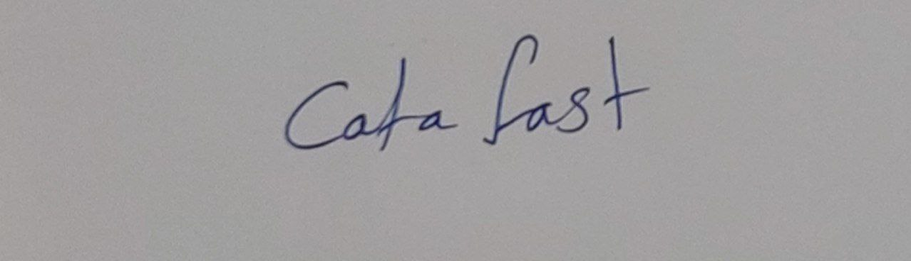
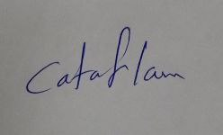
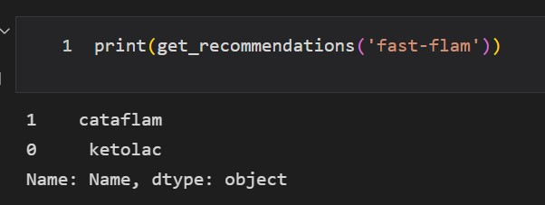

<h1 align="center">Medical Solutions</h1>

# First peoject $:-$
   ## Prescription Scan:
    - With some hand written medicines, making a CNN model can detect the right name of them.
    - Some sample of the data.
   
   
   
   
    - Cut each line in the prescription image to detect each single image separately. 
   
   
    - The model got 79% train, 70% test and the validation data in the same range.

# Second peoject $:-$
  ## Recommender System:
    - Making a content based recommender system for some medicine.
    - Compute TF-IDF and cosine similarity.
    - Use the linear_kernel from scikit-learn, which is faster than cosine_similarity.
   
